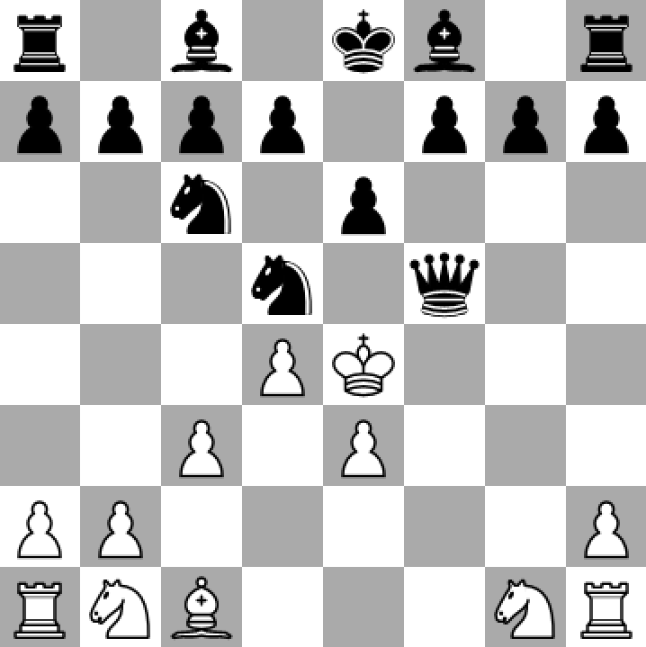
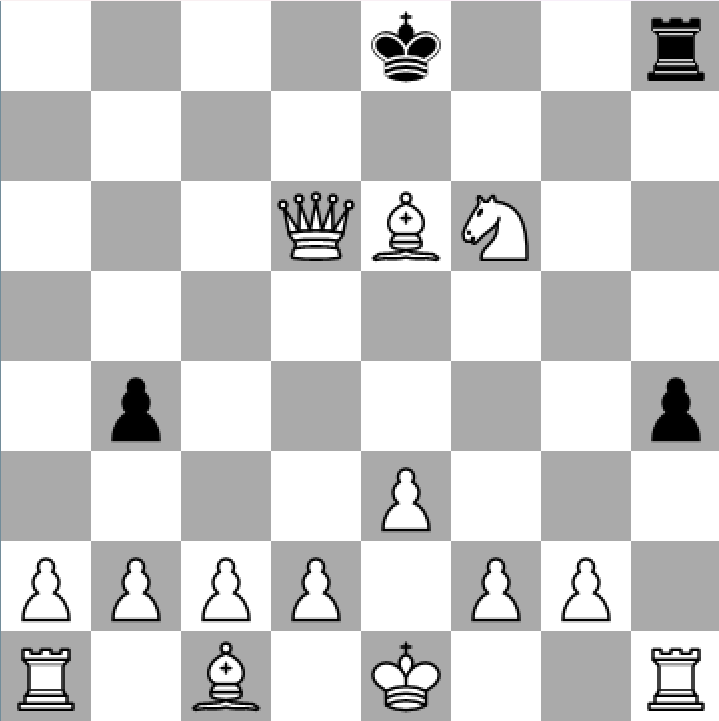
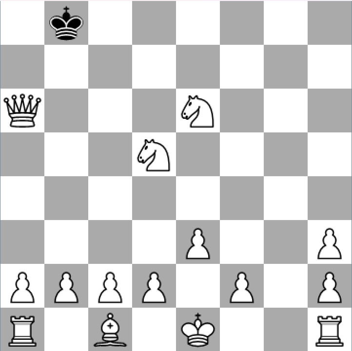

# Mini-Max
Minimax is a recursive algorithm that is used for game-playing AI and decision making. It goes through every possible choice (to a certain depth) and from that it alternates between getting the maximum score and the minimum score (this is because of turns). 

One drawback to the algorithm is that it can be very expensive to run, for example chess in the middle-game of chess there can be an average of 30-40 moves and minimax checks every single one, as well as going deeper into it so if you have a depth of 4 (which is what we used) that could be 40^4 or 2,560,000 moves to check and compute the score for.

Minimax is commonly used for two player games, like chess, checkers, and tic-tac-toe, where a score can be given to the board at a given time (Heuristics).

# Alpha Beta
Alpha Beta Pruning is a technique used in our minimax to remove any possible moves that will never be taken.
- Alpha starts as -Inf to always get the highest, opposite for Beta.
- Alpha is continuously updated to be the absolute maximum a node can be, while the Beta represents the minimum on the subtree (given the root node is searching for the Max).
- If Beta is ever Less than or Equal to Alpha, we can ignore the remaining nodes in the subtree, since they will never be picked.
- Recursively call and prune until the Minimax is selected.

This works great for chess, since the numerical values representing the board state after a move lets us calculate the the best moves and prune the worst.

# Heuristics
## Mobility
- Goes through each possible move for the player
- Decides whether a move has an enemy attacking that square
- Adds 2 points for each safe move and -1 points for each dangerous move
- Gives extra score to moves that give the player more movable squares, increasing their options

## Square Danger
- Checks the number of enemy pieces attacking the square
- Checks the number of ally pieces defending the square
- Gives 5 points for a move that is defended well
- Gives -10 points for a space that has more attackers than defenders

## King Pressure
- Finds the position of the opponent’s king
- If the opponent has 4 or less pieces, give extra points for moving the enemy king to the edges and corners of the board to make checkmate easier

## King Safety
- Defines the king’s area as the king’s square and adjacent squares
- Goes through the pieces attacking the king’s area and adds a score depending on the type of piece attacking the area
- Multiplies the sum of the points by a defined number depending on the number of pieces attacking the king’s area
- Subtracts points based on how much danger the king is in

# Project Stuff
## Images
|Black Wins|White Wins|Stalemate|
|-|-|-|
|||		   |

## Third Parties

- [Disservin/chess-library](https://github.com/Disservin/chess-library)
- [libsdl-org](https://github.com/libsdl-org)
- [ocornut/ImGUI](https://github.com/ocornut/imgui)
- [cpm-cmake/cpm.cmake](https://github.com/cpm-cmake/CPM.cmake)
- [Neargye/magic_enum](https://github.com/Neargye/magic_enum)

## Licences

[Check it out](third_party.txt)